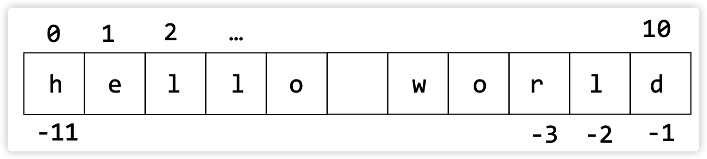

## len() 
문자열 길이 확인

```python
>>> len("hello")
5
>>> s = "문자열의 길이를 확인해요." 
>>> len(s)
14
```

## 문자열의 특정 위치 가져오기
인덱스 사용

- 앞에서 셀 때: 인덱스는 0부터 시작
- 뒤에서 셀 때: 뒤에서 -1부터 시작



## 문자열의 특정 문자는 수정불가

## 문자열.startswith("문자열")
문자열이 특정 문자열으로 시작하는 지 판단 -> bool형 반환

```python
s = "Hello World"
s.startswith('H') # s는 H로 시작하므로 True 
s.startswith('W') # s는 W로 시작하지 않으므로 False 
s.startswith('Hel') # 결과는 True
```

## 문자열.endswith("문자열")
문자열이 특정 문자열으로 끝나는 지 판단 -> bool형 반환

```python
s = "Hello World"
endswith('d') #  True 
endswith('D') #  False 
endswith('rld') # 결과는 True
```

## in키워드
`a in b` a문자열이 b문자열 안에 포함되어 있는지 확인 -> bool형 반환

```python
s = "Hello World" 
"Wor" in s # True 
"wor" in s # False
```

## 기존문자열.index("찾을 문자열")
in의 고급 버전으로 찾을 문자열이 처음 나타난 위치의 시작 index를 반환한다.
**하지만 없으면 Error를 반환하게 됨**

```python
s = "Hello World" 
s.index("W") # 6
s.index("w") # Error
s.index("rl") # 8
```

## 기존문자열.find("찾을 문자열")
in의 고급 버전으로 찾을 문자열이 처음 나타난 위치의 시작 index를 반환한다.
**하지만 없으면 -1를 반환하게 됨**

```python
s = "Hello World" 
s.find("W") # 6
s.find("w") # -1
s.find("rl") # 8
```

## index(), find()의 확장 기능
```python
# 문자열.index(검색할_문자열, startIdx, endIdx) 
# 문자열.find(검색할_문자열, startIdx, endIdx)
# 문자열[startIdx:endIdx] 안에서 찾기
>>> s = "Hello World"
>>> s.index('o', 0, 4)
Traceback (most recent call last): File "<stdin>", line 1, in <module> ValueError: substring not found
>>> s.index('o', 0, 5)
4
>>> s.find('o', 0, 4)
-1
>>> s.find('o', 0, 5)
4
```

## rindex(), rfind(): 오른쪽부터 검색
위의 index, find와 똑같이 활용 가능

## 문자열[ startIndex : endIndex ]
```python
s = "Hello World"
s[0:2] # He
s[1:4] # ell
s[:-1] # 처음부터 -2까지. 즉 끝에서 한
	   #문자 빼고 추출
s[:3] # 처음부터 3-1까지. Hel
s[:] # 처음부터 끝까지
```

## 문자열.strip()
- strip(): 문자열 양쪽의 있는 공백 문자 제거
`result = "   hello./n ".strip()` => `hello.`만 남는다.

## 문자열.strip("문자")
strip 안에 문자, 또는 문자열이 들어가면, 양쪽에 해당 문자/문자열에 포함하는 모든 문자를 제거한다. 

```python
s = "aaa123bbb"
s.strip("ba")
-> "123"
s.strip("b1a")
-> "23"
```

## 문자열.lstrip(), 문자열.rstrip()
- lstrip(), rstrip()는 왼쪽, 또는 오른쪽의 공백/문자/문자들을 제거한다
- strip의 사용법과 같다.

## 문자열.replace(oldString, newString)
문자열 치환

```python
>>> "뜨거운 커피".replace("뜨거운", "차가운") 
'차가운 커피'
```

## 문자열.isalnum()
문자열이 알파벳과 숫자로만 구성되어 있는지

```python
>>> a = "abc123"
>>> a.isalnum()
True
>>> a = "1.23"
>>> a.isalnum()
False
```

## 문자열.isdigit() / .isnumeric()
문자열이 숫자로만 구성되어 있는지

```python
>>> a = "2131234"
>>> a.isdigit()
True
>>> a.isnumeric()
True
# 1.23 -> False | -12 -> False
```

## 문자열.islower() / .isupper()
문자열이 숫자로만 구성되어 있는지

```python
>>> a = "2131234"
>>> a.isdigit()
True
>>> a.isnumeric()
True
# 1.23 -> False | -12 -> False
```